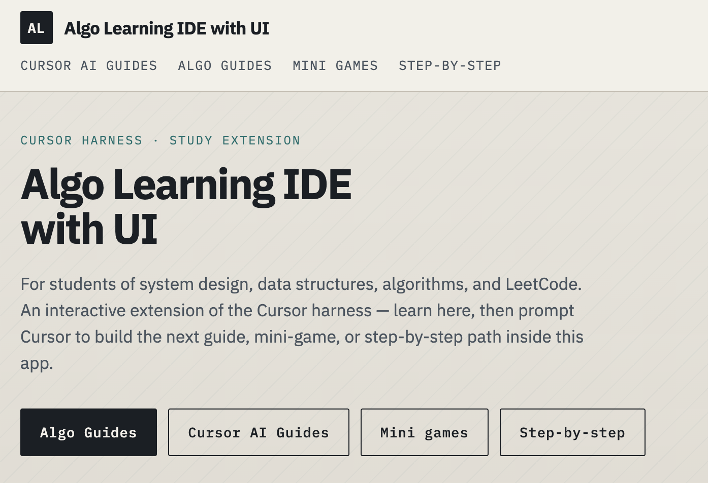
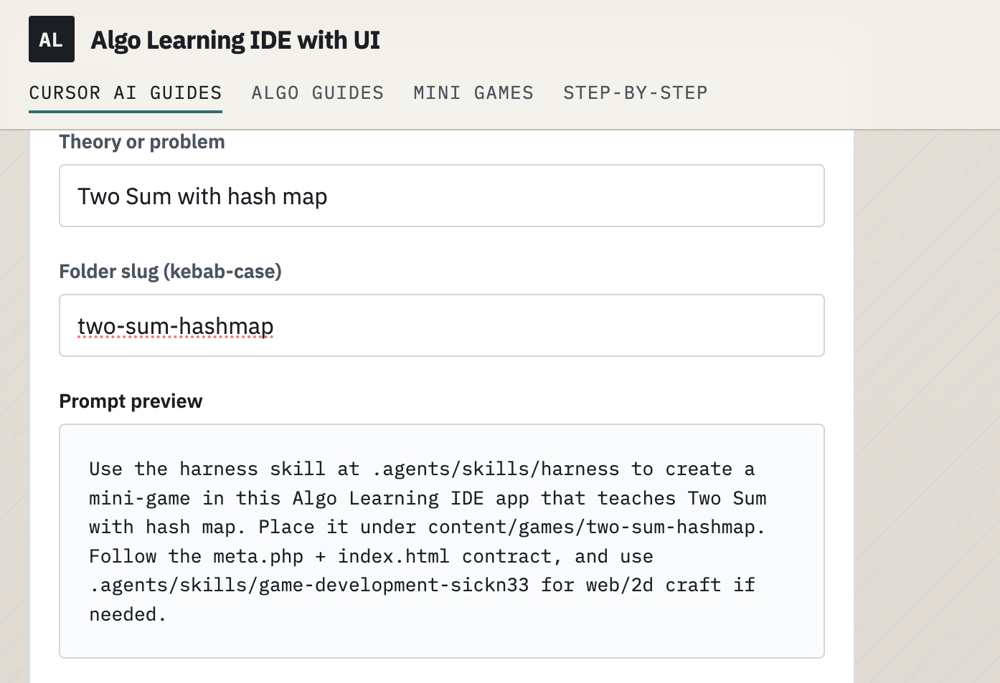
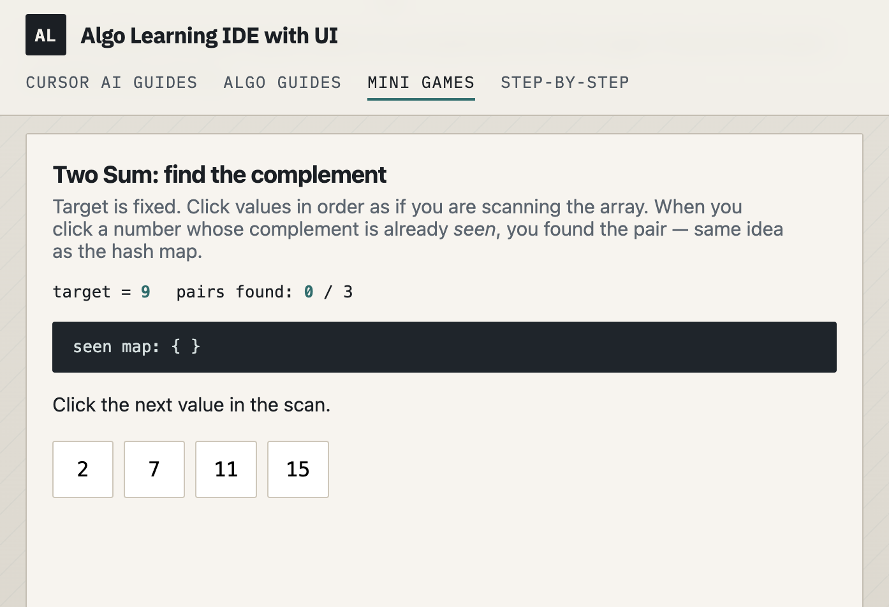
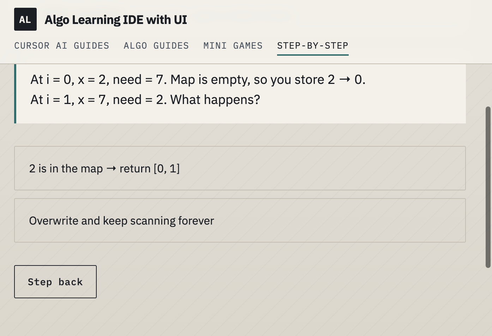

# Algo Learning IDE with UI

By Weng (Weng Fei Fung)


<a target="_blank" href="https://github.com/Siphon880gh" rel="nofollow"></a>
<a target="_blank" href="https://www.linkedin.com/in/weng-fung/" rel="nofollow"></a>
<a target="_blank" href="https://www.youtube.com/@WayneTeachesCode/" rel="nofollow"></a>

Using AI, coaches you on LeetCode problems, system design, algorithms, and data structures using a novel approach that combines your IDE Harness with the app running at localhost as an interactive artifact container.

## Screenshots

Home hub — jump into Algo Guides, Cursor AI Guides, mini games, or step-by-step sessions:



Cursor AI Guides include fillable prompt builders so you can copy a harness prompt into Cursor:



Mini games teach one idea interactively (Two Sum complement drill):



Step-by-step sessions are choice trees with path history and step-back:



## How it works

Open this repo in Cursor. The harness skill at `.agents/skills/harness` authors study artifacts. Run the PHP app locally — those artifacts appear as interactive guides, mini games, and step-by-step sessions you can work through in the browser.

When a theory or problem still does not click, the UI helps you prompt Cursor to generate the next guide, game, or coaching tree inside this same app.

## What you get

| Section | Role |
|---------|------|
| **Algo Guides** | Lessons on algorithms, system design, LeetCode, complexity |
| **Cursor AI Guides** | How to use the harness and prompt builders |
| **Mini games** | Small playable pages that teach one idea |
| **Step-by-step** | Deterministic choice trees with wrong paths and step-back |

Content lives under `content/` and is picked up by directory scan — no separate registry file.

## Run locally

Serve this directory with PHP (any local server that can run PHP). Then open the app in the browser (typically `http://localhost:…`).

```bash
php -S localhost:8080
```

## Author with the harness

In Cursor, ask the agent to use `.agents/skills/harness` to create:

- Guides → `content/guides/{slug}/` (`meta.php` + `body.md`)
- Mini games → `content/games/{slug}/` (`meta.php` + `index.html`)
- Step-by-step → `content/coaching/{slug}/` (`meta.php` + `tree.php`)

See `.agents/skills/harness/SKILL.md` and `reference.md` for contracts, `[!ui-builder]` prompt widgets, and schemas.
